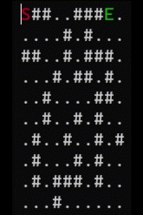

# Maze Solver How To
Short and simple maze solver.

## Edit the maze in `maze.txt`.
- Periods(`.`) denote empty spaces
- Hashtags(`#`) denote walls
- `S` denotes starting point of maze
- `E` denotes ending point of maze

## Run the program
Run `maze_solver.py.` Default settings will visualize both BFS and DFS. 

You can specify to only visualize one by changing the last line to `show_algos('dfs')` and `show_algos('bfs')` to visualize the respective algorithms.

  

